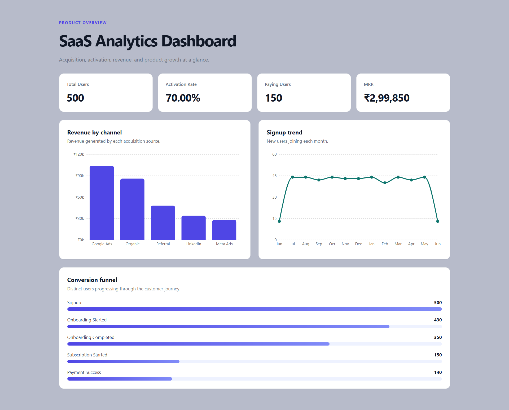
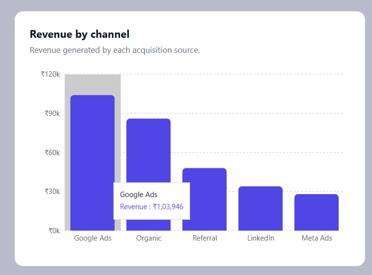
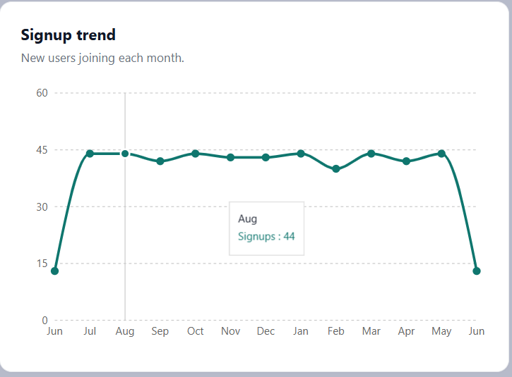

# SaaS Product Analytics Dashboard

A full stack analytics dashboard built using React.js, Node.js, Express.js, SQLite, and SQL. The application analyzes user acquisition, activation, subscriptions, revenue, and conversion metrics through interactive charts and KPI dashboards.

## Features

* KPI dashboard for Total Users, Activation Rate, Paying Users, and Monthly Recurring Revenue (MRR)
* Revenue analysis by acquisition channel
* Monthly signup trend visualization
* Conversion funnel tracking from signup to payment
* REST APIs built with Express.js and SQLite
* Interactive data visualizations using Recharts

## Tech Stack

### Frontend

* React.js
* Vite
* Recharts
* CSS

### Backend

* Node.js
* Express.js

### Database

* SQLite
* SQL

## Project Structure

```text
backend/
database/
frontend/
README.md
```

## Analytics Metrics

* Total Users
* Activation Rate
* Paying Users
* Monthly Recurring Revenue (MRR)
* Revenue by Acquisition Channel
* Signup Trends
* Conversion Funnel Metrics

## Getting Started

### Backend

```bash
cd backend
node app.js
```

### Frontend

```bash
cd frontend
npm run dev
```

The dashboard runs on:

* Frontend: http://localhost:5173
* Backend API: http://localhost:3001

```
```
## Screenshots




